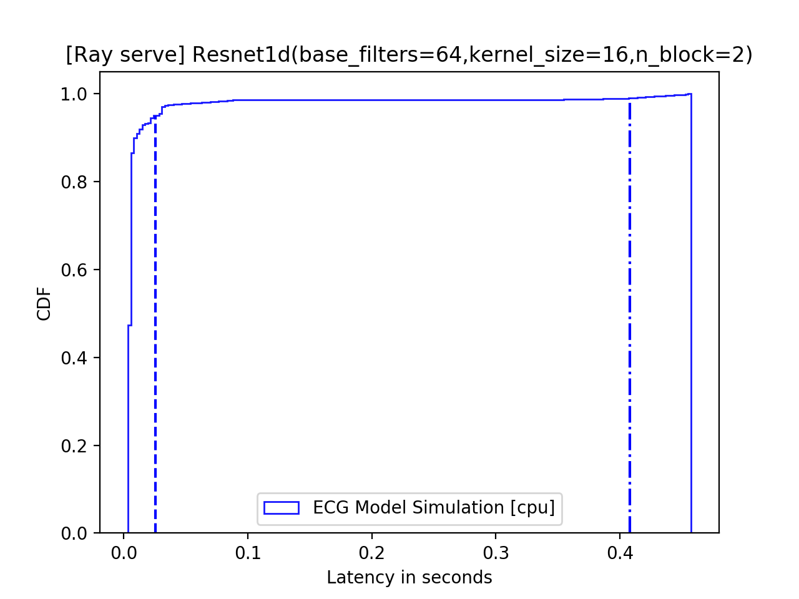
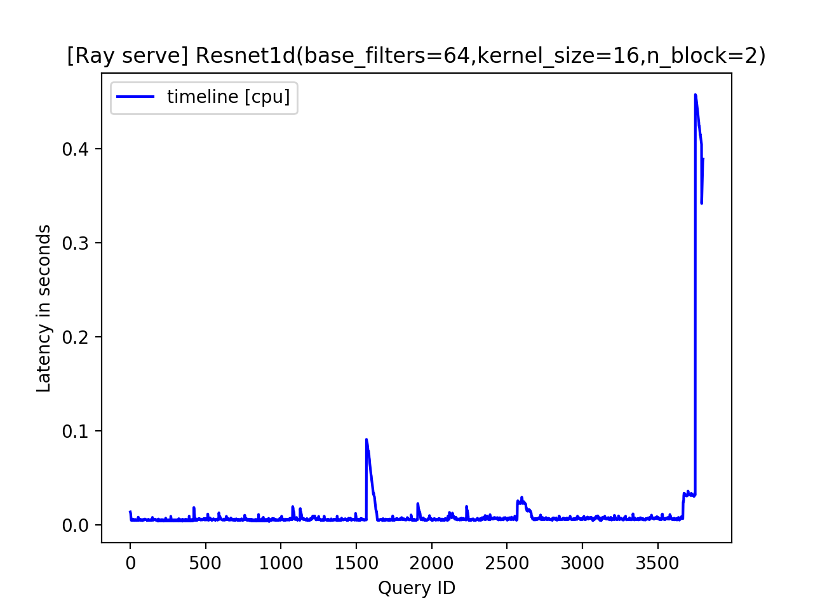

# serve-healthcare
### Cloning the repository
`git clone --recurse-submodules https://github.com/alindkhare/serve-healthcare.git`
### Installing Ray
1. `cd serve-healthcare`
2. `bash ./ray/ci/travis/install-bazel.sh` 
3. `cd ./ray/python && pip install -e .[serve]  --verbose`
4. `cd ../../`
### Installing Python Packages
1. `pip install -r requirement.txt`
### Running the profiling code
Running `python profile.py` populates `.jsonl` file for time taken by each query.
Using `.jsonl` file following can be plotted - 

